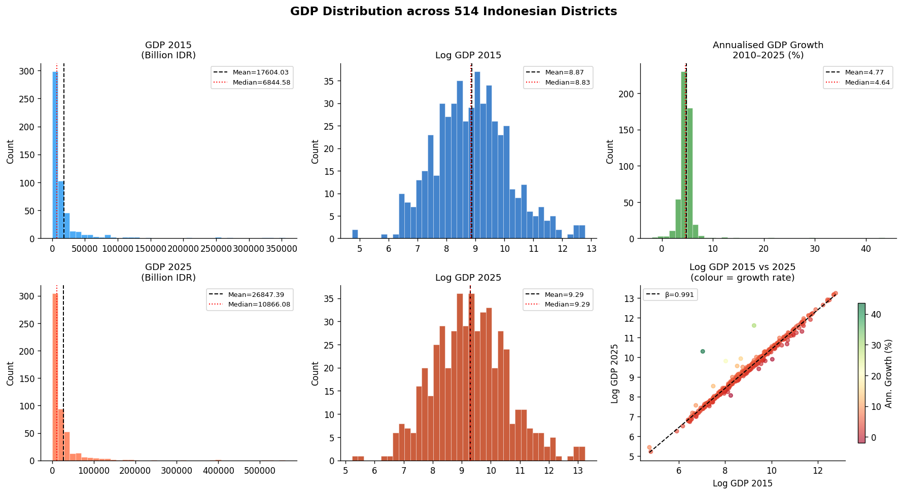
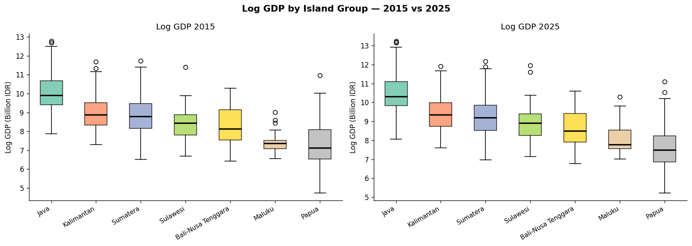
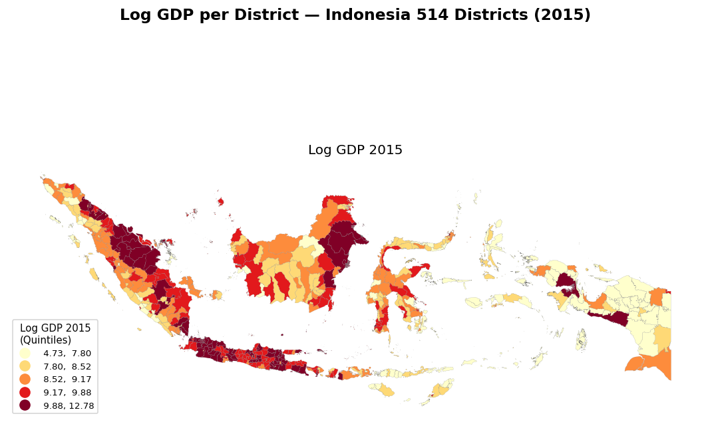
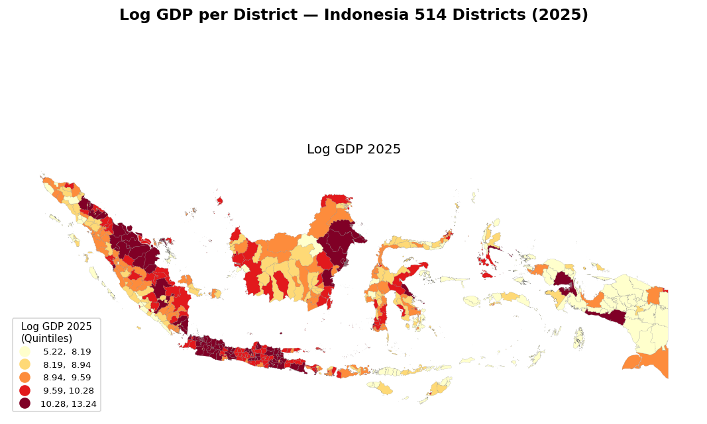
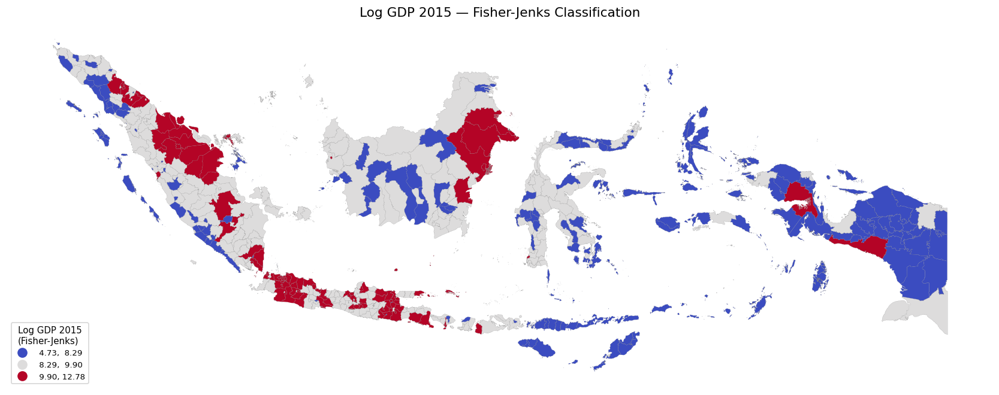
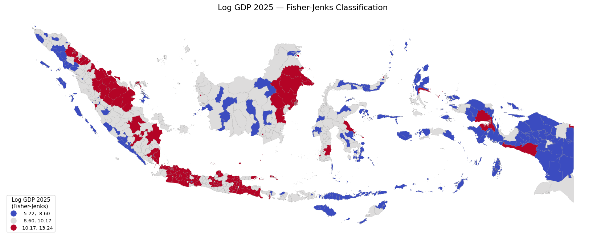
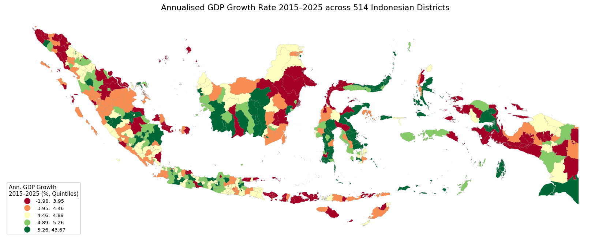

# Gross Domestic Product (GDP) total and per capita

This folder contains district-level data for **Total Gross Domestic Product (GDP) total and per capita**, also known in Indonesian as **Produk Domestik Regional Bruto (PDRB)**.

## 1. GDP Total / PDRB

### Indicator
* **Name:** GDP / PDRB real (constant 2010 prices)
* **Unit:** Billion IDR
* **Definition:** Total value of goods and services produced within a district/city in a given year.
* **Coverage:** Annual district-level data for all Indonesian districts/cities (2010–2025).
* **Source:** https://www.bps.go.id/id/statistics-table/2/MjE5NCMy/-seri-2010--pdrb-atas-dasar-harga-konstan--2010-100--menurut-pengeluaran-kabupaten-kota--milyar-rupiah-.html

### File
* `gdp.csv`: Main GDP dataset.

### Data Notes
* **Years 2010–2025:** Data compiled from official BPS (Statistics Indonesia) publications via BPS Web API (SIMDASI endpoint).
* **Year 2024–2025:** Preliminary estimate (*Angka sementara*) where applicable.
* Administrative boundary harmonization follows the district/city classification used in the dataset.

### Exploratory Data Analysis (EDA) Summary

An EDA of GRDP across 514 Indonesian districts was conducted for 2015 and 2025. Full notebook available on [Google Colab](https://colab.research.google.com/drive/1ntltJr-FjdMdA9t9DgOZ9qUFSO4WvOlu).

#### Descriptive Statistics

| Statistic | GDP 2015 (Billion IDR) | GDP 2025 (Billion IDR) | Log GDP 2015 | Log GDP 2025 | Ann. Growth (%) |
|-----------|------------------------|------------------------|--------------|--------------|-----------------|
| Mean      | 17,604                 | 26,847                 | 8.87         | 9.29         | 4.77            |
| Median    | 6,845                  | 10,866                 | 8.83         | 9.29         | 4.64            |
| Std Dev   | 37,898                 | 58,870                 | 1.28         | 1.28         | 2.53            |
| Min       | 113                    | 185                    | 4.73         | 5.22         | -1.98           |
| Max       | 355,093                | 560,760                | 12.78        | 13.24        | 43.67           |

#### Key Findings

**1. Highly skewed distribution**

Raw GDP values are heavily right-skewed, with a few districts recording very high GDP driven largely by natural resource extraction (oil, gas, and mining). Log transformation effectively normalizes the distribution, making it more suitable for econometric analysis. The annualized GDP growth rate over 2015–2025 averaged 4.77% (median 4.64%), with considerable dispersion (std = 2.53%). Some districts recorded negative growth (-1.98%) while others grew exceptionally fast (up to 43.67%).

**2. Strong rank persistence**

The scatter plot of Log GDP 2015 vs. 2025 shows a near-unity slope (β = 0.991), indicating strong rank persistence — districts with higher GDP in 2015 generally maintained their relative position in 2025. This suggests that the overall structure of regional inequality has remained largely stable over the decade.

**3. Island-level disparities**

Significant inter-island differences persist in both years. Java consistently records the highest median Log GDP, followed by Kalimantan and Sumatera. Maluku and Papua remain at the lower end, suggesting persistent spatial inequality across the archipelago.

**4. Spatial concentration — Quintile Maps**

Choropleth maps using quintile classification reveal persistent GDP concentration in Java, parts of Kalimantan (resource-rich districts), and select urban centers across other islands. The spatial pattern remains largely stable between 2015 and 2025.

**5. Three-tier structure — Fisher-Jenks Classification**

Fisher-Jenks classification confirms a clear three-tier structure: low, middle, and high GDP districts. The high-GDP cluster (red) is concentrated in Java and resource-rich districts in Kalimantan, while the low-GDP cluster (blue) dominates Papua and parts of Nusa Tenggara. This three-tier pattern is consistent across both 2015 and 2025.

**6. Heterogeneous growth across space**

The annualized GDP growth rate map reveals high spatial heterogeneity. Fast-growing districts (dark green) are scattered across Kalimantan, Sulawesi, and parts of Papua, likely reflecting new resource development and infrastructure investment. Slow-growing or declining districts (dark red) are found across Java and parts of Sumatera, possibly reflecting maturation effects.

## 2. GDP per Capita / PDRB per Capita
## Indicator

* **Name:** GDP per Capita
* **Unit:** Million IDR per Person
* **Definition:** Gross Regional Domestic Product divided by the total population of the district/city.
* **Coverage:** Annual district-level data for all Indonesian districts/cities.

## Data Notes

* **Years 2000–2015:** Data compiled from the Indonesia Regional Dataset developed by QuaRCS Lab.
* **Years 2016–2024:** Data compiled from official BPS (Statistics Indonesia) publications.
* **Year 2024:** Preliminary estimate (*Angka sementara*) where applicable according to BPS publications.
* Administrative boundary harmonization follows the district/city classification used in the dataset.

## File

* `gdp_pc.csv`: Main GRDP per Capita dataset.

## Data Source

### 2000–2015

* Gunawan, A., Mendez, C., Santos-Marquez, F., Aginta, H., & Miranti, R. C. (2021).
  *Indonesia Regional Dataset – Data supplementary material for published papers of the QuaRCS lab (v1.0.0) [Data set].*
  Zenodo.
  https://doi.org/10.5281/zenodo.4427713

### 2016–2024

* BPS Statistics Indonesia (Badan Pusat Statistik).
  Regional Gross Domestic Product (GRDP/PDRB) publications and district-level statistical tables.
  https://www.bps.go.id

## Citation

If you use this dataset, please cite:

Gunawan, A., Mendez, C., Santos-Marquez, F., Aginta, H., & Miranti, R. C. (2021). *Indonesia Regional Dataset – Data supplementary material for published papers of the QuaRCS lab (v1.0.0) [Data set].* Zenodo. https://doi.org/10.5281/zenodo.4427713

and the corresponding BPS publications used for the 2016–2024 updates.
